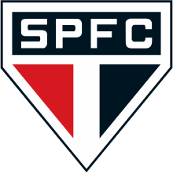

# EventFlow SPFC 🇾🇪 | Gestão de Eventos & Matchday Ops

<p align="center">
  
</p>

<p align="center">
  <strong>Plataforma executiva de governança operacional de matchday, gestão de ativações de patrocinadores, controle de fornecedores e comprovação de contrapartidas do São Paulo FC no MorumBIS.</strong>
</p>

<p align="center">
  
  
  
  
  
  
</p>

---

## 📌 Contexto e Propósito

O **EventFlow SPFC** foi desenvolvido para resolver uma das dores centrais na operação de grandes clubes de futebol: **a complexidade logística e operacional de um dia de jogo (matchday)** e a **garantia de entrega impecável de ativações contratuais de patrocinadores**.

Integrado conceitualmente ao ecossistema de gestão esportiva:
> **SponsorHub** (Contratos & CRM) ➔ **EventFlow** (Operação de Campo & Execução) ➔ **FanMetrics** (Inteligência & Engajamento)

---

## 🚀 Funcionalidades Principais

### 1. 📊 Dashboard Executivo de Operações (`/`)
- **KPIs em Tempo Real**: Total de eventos ativos, taxa de execução no prazo (% checklists cumpridos), custos orçados vs realizados e itens em atraso.
- **Hero Banner de Matchday**: Contagem regressiva, local e status do próximo jogo no MorumBIS.
- **Gráficos Financeiros & Ciclo de Vida (Recharts)**: Comparativo orçado vs realizado por operação e distribuição percentual de status.
- **Alertas Operacionais Urgentes**: Lista dinâmica de tarefas críticas e pendências de validação.

### 2. 📅 Calendário Interativo & Linha do Tempo de Matchday (`/calendar`)
- **Visão Mensal de Eventos**: Navegação mês a mês com identificadores visuais categorizados (*Jogos, Ativações, Torcedores*).
- **Painel Lateral do Dia Selecionado**: Acesso direto a todas as operações agendadas para a data.
- **Linha do Tempo Tática T-Hours (Cronograma Regressivo)**:
  - **T-6h**: Vistoria técnica e engenharia de campo (LEDs, VAR, gramado).
  - **T-4h**: Cenografia e zonas de hospitalidade/patrocinador.
  - **T-2h**: Abertura de portões e liberação de catracas faciais.
  - **T-45m**: Aquecimento dos atletas e cerimonial das mascotes.
  - **T-0**: Apito inicial e monitoramento de tempo de exibição.
  - **T+2h**: Coletiva de imprensa, upload de fotos e auditoria de comprovação.

### 3. 📋 Gestão Completa de Eventos (`/events`)
- **Filtros Rápidos e Painel Avançado**:
  - Filtro por tipo (*Jogos, Ativações, Eventos de Torcedor*).
  - Filtro por status (*Planejado, Em Execução, Concluído, Cancelado*).
  - Filtros avançados com contador: por Patrocinador, por Local (*Venue*) e por Situação do Checklist (*Com atrasos, Pendentes, 100% concluídos*).
- **Exportação para Microsoft Excel (.csv)**:
  - Exportação da lista consolidada com formatação monetária (BRL) e codificação `UTF-8 BOM` para compatibilidade total no Excel.
  - Botão de exportação individual em cada card de evento.
- **Edição Ágil de Eventos**: Botão dedicado em cada card e no cabeçalho dos detalhes para atualizar metadados, datas e orçamentos.

### 4. 🔍 Visão 360° da Operação (`/events/[id]`)
- **Cronograma & Checklist Operacional**:
  - Toggle de status com 1 clique (`PENDENTE` ➔ `EM_ANDAMENTO` ➔ `CONCLUIDO`).
  - **Edição em linha de tarefas**: Edição direta de descrição, responsável e deadline.
  - Formulário para adição de novas tarefas operacionais.
- **Gestão de Fornecedores & Custos**:
  - Comparação item a item de custo previsto vs faturado.
  - Modal para alocação de novos prestadores de serviço e cálculo automático de saldo orçamentário.
- **Comprovação de Entrega (Proofs)**:
  - Galeria de fotos e relatórios de campo auditáveis.
  - Fluxo de auditoria com botão para **Validar e Aprovar Entrega**.

### 5. 🤝 Fornecedores & Parceiros Homologados (`/vendors`)
- Central de contratos operacionais (*Cenografia, Segurança Privada, Som & Luz, Transporte/Logística, Buffet/Catering, Gráfica*).
- Balanço acumulado de valores contratados vs executados e economia operacional gerada.

### 6. 🌓 Design System Tricolor com Dark & Light Mode
- Alternância instantânea de tema no topo da navegação com persistência em `localStorage`.
- **Escudo Inteligente do SPFC**:
  - **Modo Claro**: Utiliza o escudo oficial com contorno preto (`spfc-logo-outline.png`) para contraste nítido em fundos brancos.
  - **Modo Escuro**: Utiliza o escudo oficial com sombra suave (`spfc-logo.png`).

---

## 🛡️ Proteção de Dados & Marcas Fictícias

Para resguardar dados contratuais sensíveis e confidenciais do São Paulo FC, toda a massa de dados do projeto foi estruturada com **marcas fictícias clássicas da cultura pop**:

| Patrocinador Fictício | Inspiração | Escopo de Ativação no MorumBIS |
|---|---|---|
| **Acme Corporation** | Looney Tunes | Placas perimetrais de LED e infláveis de campo |
| **Wonka Industries** | Fantástica Fábrica de Chocolate | Experiência do *Bilhete Dourado* nos camarotes |
| **Wayne Enterprises** | DC / Batman | Iluminação cênica de alta tecnologia e hospitalidade VIP |
| **Stark Industries** | Marvel / Homem de Ferro | Show sincronizado de 200 drones no gramado |
| **Los Pollos Hermanos** | Breaking Bad | Festival gastronômico na Praça Roberto Pedrosa |
| **Cyberdyne Systems** | Exterminador do Futuro | Catracas com biometria facial nos acessos |
| **Dunder Mifflin Paper Co.** | The Office | Chuva de papel picado certificado antichamas |
| **Monsters, Inc.** | Monstros S.A. | Ação *Torcedor Mirim* com o Santo Paulo |

---

## 🛠️ Stack Tecnológica

| Camada | Tecnologia |
|---|---|
| **Framework Fullstack** | [Next.js 16 (App Router)](https://nextjs.org/) + React 19 |
| **Linguagem** | [TypeScript 5](https://www.typescriptlang.org/) |
| **Estilização** | [Tailwind CSS v4](https://tailwindcss.com/) com CSS Variables |
| **Banco de Dados** | [Neon](https://neon.tech/) Serverless PostgreSQL 18 |
| **ORM** | [Prisma 6](https://www.prisma.io/) com Prisma Client & Migrations |
| **Visualização de Dados** | [Recharts 3](https://recharts.org/) |
| **Ícones** | [Lucide React](https://lucide.dev/) |
| **Manipulação de Datas** | [date-fns](https://date-fns.org/) com localização `pt-BR` |

---

## ⚙️ Como Executar Localmente

### Pré-requisitos
- Node.js 20+ instalado
- Git instalado

### 1. Clonar o repositório
```bash
git clone https://github.com/flopesds/eventflow-spfc.git
cd eventflow-spfc
```

### 2. Instalar dependências
```bash
npm install
```

### 3. Configurar variáveis de ambiente
Crie um arquivo `.env` na raiz do projeto:
```env
DATABASE_URL="postgresql://[user]:[password]@[endpoint].neon.tech/neondb?sslmode=require"
```

### 4. Sincronizar o banco de dados e aplicar o Seed
```bash
npx prisma db push
npx prisma db seed
```

### 5. Iniciar o servidor de desenvolvimento
```bash
npm run dev
```
Acesse [`http://localhost:3000`](http://localhost:3000) (ou `http://localhost:3001`).

---

## ☁️ Deploy na Vercel

O projeto está otimizado para deploy na **Vercel** com geração automática do Prisma Client via script `"postinstall": "prisma generate"`.

1. Importe o repositório `flopesds/eventflow-spfc` na [Vercel](https://vercel.com/new).
2. Adicione a variável de ambiente:
   - `DATABASE_URL`: URL de conexão pooled do Neon PostgreSQL.
3. Clique em **Deploy**.

---

<p align="center">
  Desenvolvido com excelência operacional para o <strong>São Paulo Futebol Clube</strong> 🇾🇪
</p>
